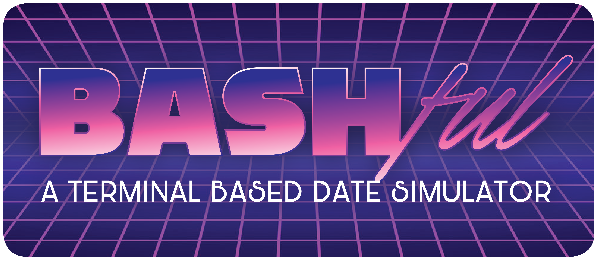

# BASHful: A Terminal Date Simulator

## Created By DEAD ANT: 
Dylan Corvidae, 
Evan Andrewson,
Angela Vawser, 
Donna Lambert, 
Antonella Gutierrez

## Description: 
✧･ﾟ: ✧･ﾟ: A Terminal Based Dating Simulator :･ﾟ✧:･ﾟ✧

## Problem Domain: 
Are you too bashful to go outside and talk to real people?  Here is a dating simulator to help curb those social anxiety fears. Refine your ideas for what constitutes the perfect date.  For all genders and orientations.

## Semantic Versioning: 
1.0.0

## API Documentation:
* [postman](https://documenter.getpostman.com/view/3514331/SVtZvRrK?version=latest)
* [travis](https://travis-ci.com/Team-Dead-Ant/BASHful)
* [heroku](https://bashful-game.herokuapp.com/)

### Libraries, Frameworks, Packages: 
bcryptjs
chalk
chalk-pipe
chance 
dotenv 
email-validator
eslint 
express 
inquirer
jsonwebtoken 
mongoose
morgan 
nodemon
play-sound
superagent
terminal-image 
prettier
supertest
jest

## User Needs For Deploying Your Own Version Of App: 
* Clone this repo to your local machine
* Navigate into your newly cloned folder
* Install libraries listed above with `npm i`
* To launch the game, type `node client/index.js`
* If you're running a Mac, be sure to crank up the volume!

## User Stories:
* As a user, I want to be able to create a profile, so that I can be matched with a date.
* As a user, I want to be able to answer questions, so that I can get better matches.
* As a user, I want to be able to simulate a date with my match, so that I can simulate meeting interesting people.
* As a user, I want to be able to interact with my simulated date, so I can find out if we truly match
* As a user, I want to be able get a result after my simulated date, to see if I want to date my virtual date match again

## Conflict Plan:
- open and honest communication 
- remove self from conflict/situation 
- Dylan has offered to help with conflict resolution. If Dylan is having issues, please tell them to: "Get your shit together. Get it all together. And put it in a backpack. All your shit. So it’s together. And if you gotta take it somewhere, take it somewhere, you know, take it to the shit store and sell it… Or put it in a shit museum, I don’t care what you do, you just gotta get it together."
- time management

## Communication Plan: 
- open and honest communication 
- open and honest communication X2 more

## Mob/pair programming: 
- debugging 
- unsure tutorials 
- merging done as group